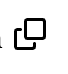
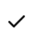

# template ts browser

[](README.md)
[](README.md)
[](https://semver.org/)
[](LICENSE)

A button to copy some text to the system clipboard, made with webcomponents.

## install
```sh
npm i -S @nichoth/copy-button
```

## use

### index.js
Import this file. It depends on [tonic](https://github.com/nichoth/tonic), so you will need to provide `Tonic` somehow, either through a bundler or `importmap`.

```js
import { CopyButton } from '@nichoth/copy-button'
```

### index.bundle.js
Import this file, including all its dependencies.

```js
import { CopyButton } from '@nichoth/copy-button/bundle'
```

### index.min.js
Use a minified version of this file. It includes all dependencies.

```js
import { CopyButton } from '@nichoth/copy-button/min'
```

## example

```js
import { CopyButton } from '@nichoth/copy-button'

document.body.innerHTML = `<${copy-button}></${copy-button}>`
```

Create a button like this



-------


